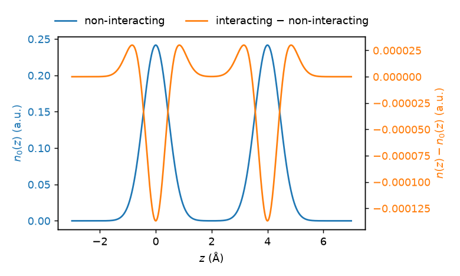

QDO charge densities
====================

libMBD can evaluate the charge density of the quantum Drude oscillators
(QDOs) that underlie the MBD model, both without the dipole coupling
(:meth:`~pymbd.fortran.MBDGeom.nonint_density`) and with it
(:meth:`~pymbd.fortran.MBDGeom.int_density`). Both take a set of points and
the QDO parameters and return the density at those points, so plotting is
just a matter of choosing a grid. The underlying derivation is given in
J. Hermann, *Towards unified density-functional model of van der Waals
interactions*, PhD thesis, Humboldt-Universität zu Berlin, 2018,
`doi:10.18452/18706 <https://doi.org/10.18452/18706>`_, Ch. 4, §4.3.1
(charge density) and §4.3.2 (first-order perturbation correction).

The QDO parameters follow from the vdW parameters via
:math:`\omega_A=\tfrac43 C_{6,A}/\alpha_{0,A}^2` and
:math:`\alpha_{0,A}=q_A^2/(m_A\omega_A^2)`. The MBD convention sets
:math:`m_A=1`, which gives :math:`q_A=\omega_A\sqrt{\alpha_{0,A}}`. The
interacting density additionally needs the coupled MBD normal modes,
obtained from a geometry constructed with ``get_spectrum=True``. Both
densities integrate to :math:`\sum_A q_A`.

The following minimal example evaluates both densities of an argon dimer
along the bond axis and plots the non-interacting density together with the
change induced by the coupling, using Matplotlib:

.. code-block:: python

    import numpy as np
    import matplotlib.pyplot as plt

    from pymbd import ang, from_volumes
    from pymbd.fortran import MBDGeom

    # argon dimer along z, 4 Å apart
    coords = np.array([[0.0, 0.0, 0.0], [0.0, 0.0, 4 * ang]])
    alpha_0, C6, R_vdw = from_volumes(['Ar', 'Ar'], [1.0, 1.0])

    # QDO parameters (mass = 1 convention)
    omega = 4 / 3 * C6 / alpha_0**2
    m = np.ones_like(alpha_0)
    q = omega * np.sqrt(alpha_0 * m)

    # line of points along the bond axis
    z = np.linspace(-3, 7, 500) * ang
    pts = np.stack([np.zeros_like(z), np.zeros_like(z), z], axis=1)

    # non-interacting density
    rho_0 = MBDGeom(coords).nonint_density(pts, q, m, omega)

    # interacting density, needs the coupled MBD modes
    geom = MBDGeom(coords, get_spectrum=True)
    _, eigs, modes = geom.mbd_energy(alpha_0, C6, R_vdw, beta=0.83)
    rho = geom.int_density(pts, q, m, np.sqrt(eigs), modes)

    # the coupling effect is tiny, so plot it against the non-interacting
    # density on a separate axis
    fig, ax = plt.subplots()
    l1, = ax.plot(z / ang, rho_0, color='C0', label='non-interacting')
    ax.set_xlabel(r'$z$ (Å)')
    ax.set_ylabel(r'$n_0(z)$ (a.u.)', color='C0')
    ax.tick_params(axis='y', labelcolor='C0')

    ax2 = ax.twinx()
    l2, = ax2.plot(z / ang, rho - rho_0, color='C1',
                   label='interacting − non-interacting')
    ax2.set_ylabel(r'$n(z) - n_0(z)$ (a.u.)', color='C1')
    ax2.tick_params(axis='y', labelcolor='C1')

    ax.legend(handles=[l1, l2], loc='lower center',
              bbox_to_anchor=(0.5, 1.0), ncol=2, frameon=False)
    fig.tight_layout()
    plt.show()

which produces:

        induced by the dipole coupling, along the bond axis
    :width: 100%

    Non-interacting QDO charge density of an argon dimer (left axis) and the
    change induced by the dipole coupling (right axis), along the bond axis.

For a weakly bound system such as the argon dimer the coupling barely
perturbs the density — note the four-orders-of-magnitude difference between
the two axes. The coupling depletes density at the oscillator centers and
shifts it into the bond region; the effect grows for more polarizable,
strongly coupled systems.
